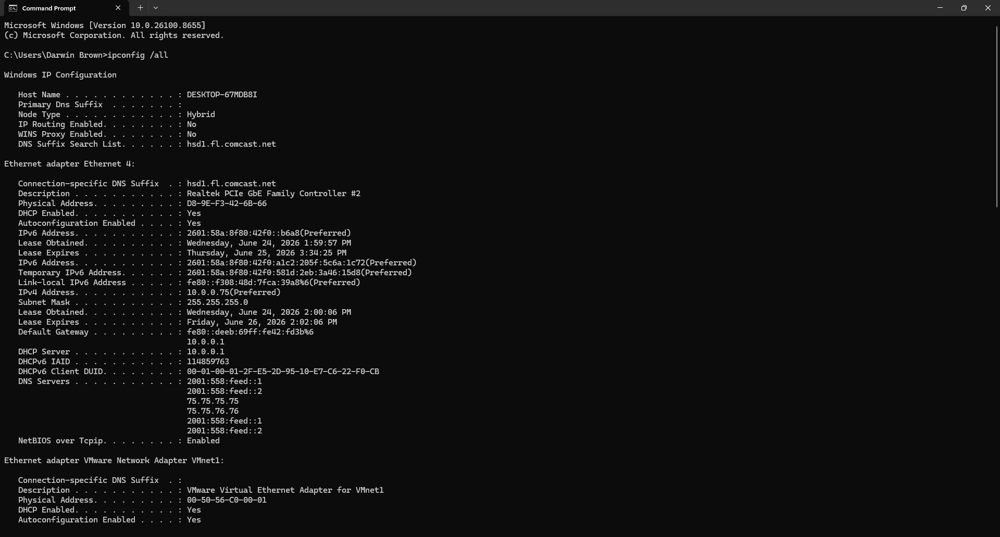
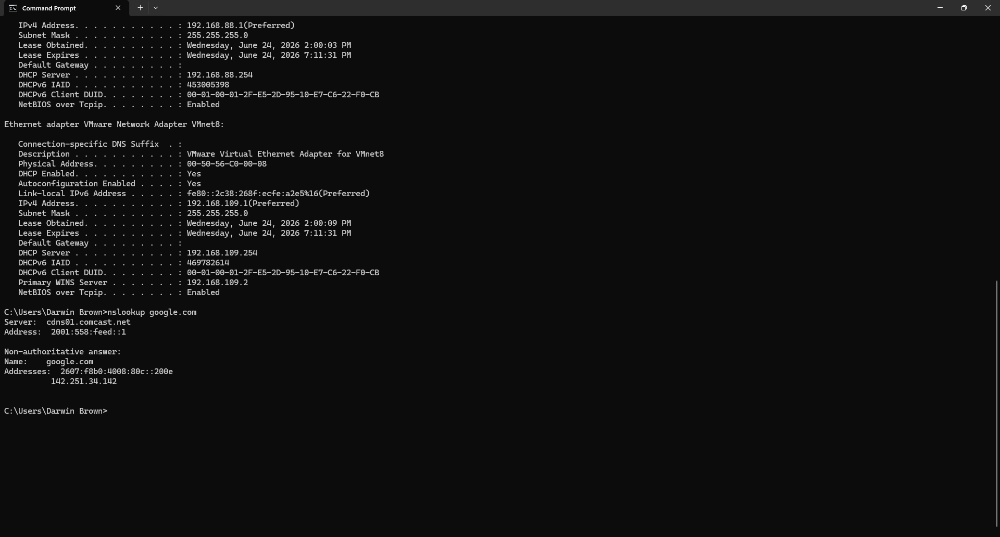
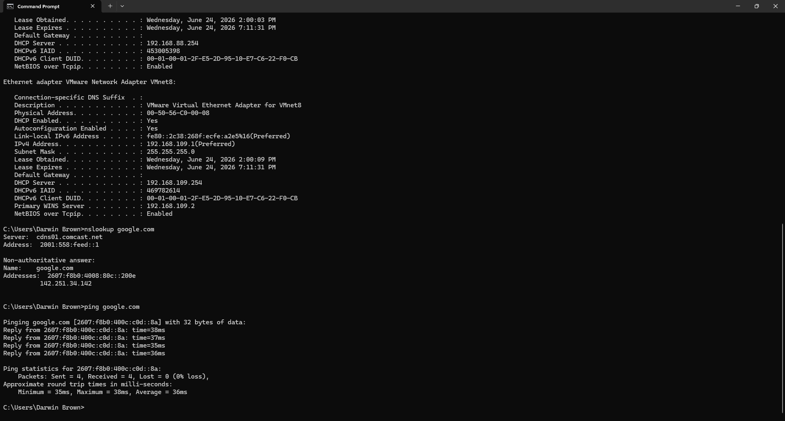
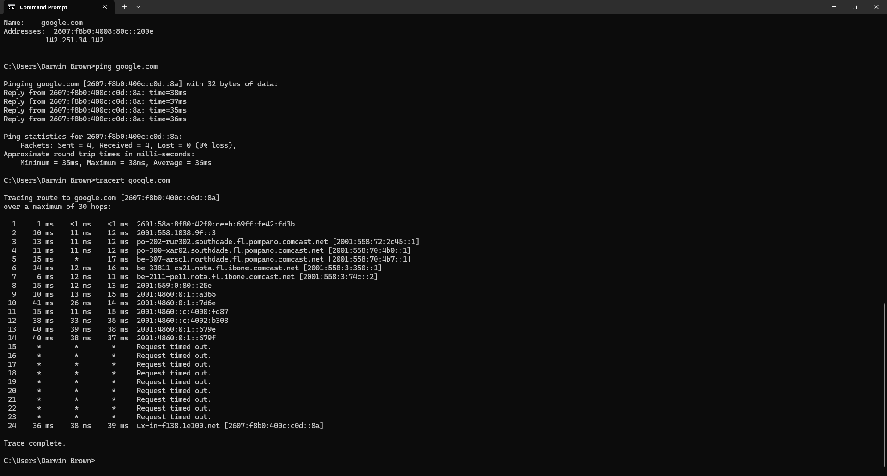
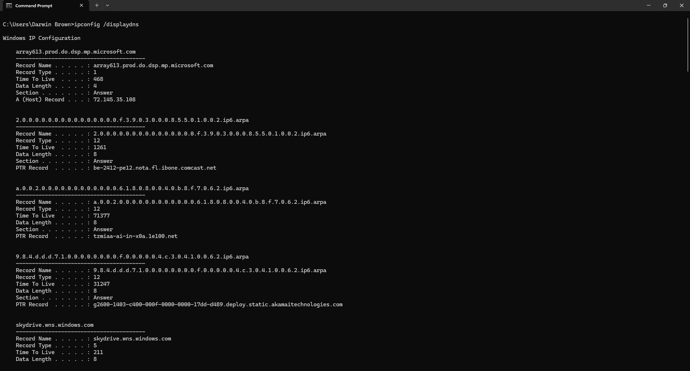
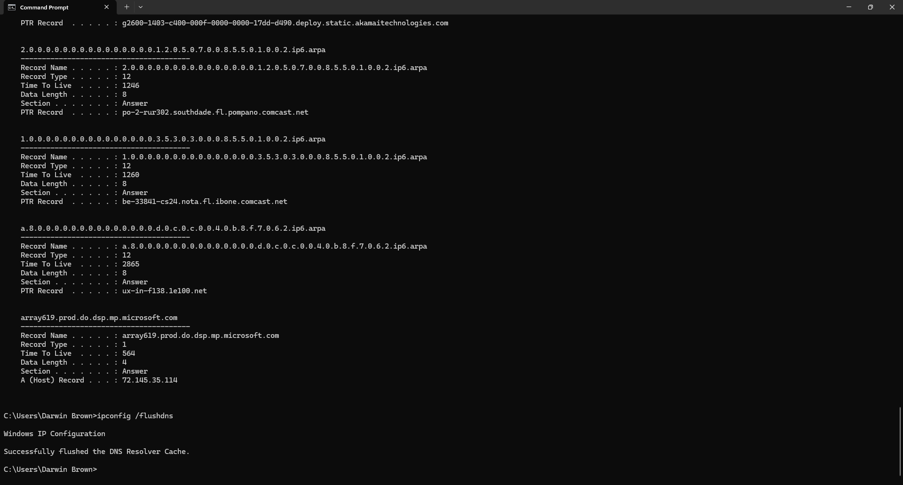
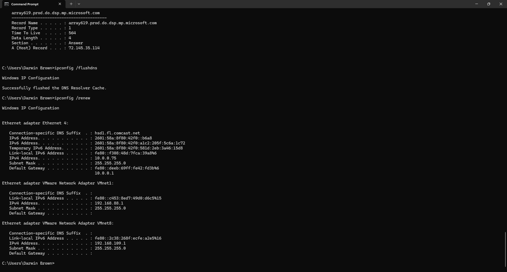
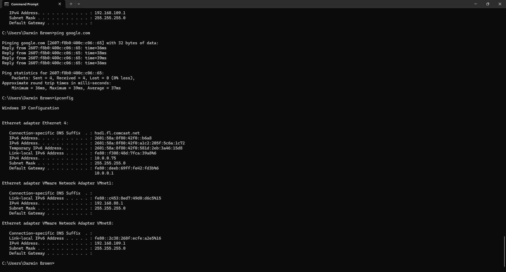

# Darwin Network Troubleshooting Lab

## Overview

This project demonstrates common Windows 11 network troubleshooting techniques used by Help Desk and IT Support professionals.

The lab walks through identifying network connectivity issues, verifying IP configuration, testing DNS resolution, checking internet connectivity, reviewing DNS cache, renewing network configuration, and documenting the troubleshooting process using built-in Windows networking tools.

---

## Skills Demonstrated

- Windows 11 Administration
- Help Desk Troubleshooting
- Network Troubleshooting
- TCP/IP Configuration
- DNS Troubleshooting
- DHCP Troubleshooting
- Command Prompt
- Windows Networking Tools
- Documentation

---

## Tools Used

- Windows 11
- Command Prompt
- Network Connections
- ipconfig
- nslookup
- ping
- tracert

---

## Troubleshooting Steps

### 1. Verify Network Connections

Reviewed active network adapters to confirm the Ethernet connection was enabled.

### 2. Review IP Configuration

Used:

```cmd
ipconfig /all
```

to verify IPv4 address, subnet mask, gateway, DHCP, and DNS settings.

### 3. Test DNS Resolution

Used:

```cmd
nslookup google.com
```

to verify successful DNS name resolution.

### 4. Test Internet Connectivity

Used:

```cmd
ping google.com
```

to confirm successful communication with zero packet loss.

### 5. Trace Network Path

Used:

```cmd
tracert google.com
```

to identify the route packets take to the destination.

### 6. Display DNS Cache

Used:

```cmd
ipconfig /displaydns
```

to review locally cached DNS records.

### 7. Flush DNS Cache

Used:

```cmd
ipconfig /flushdns
```

to clear the Windows DNS Resolver Cache.

### 8. Renew IP Address

Used:

```cmd
ipconfig /renew
```

to obtain a refreshed IP address from the DHCP server.

### 9. Final Verification

Performed a final connectivity test using:

```cmd
ping google.com
```

and

```cmd
ipconfig
```

to verify the system was functioning correctly after troubleshooting.

---

## Screenshots

### 1. Network Connections

Verified active network adapters in Windows.


---

### 2. IP Configuration

Displayed detailed network configuration using `ipconfig /all`.



---

### 3. DNS Lookup

Verified DNS name resolution using `nslookup`.



---

### 4. Ping Test

Confirmed internet connectivity with zero packet loss.



---

### 5. Traceroute

Traced the network path to Google's servers.



---

### 6. DNS Cache

Displayed the local DNS resolver cache using `ipconfig /displaydns`.



---

### 7. Flush DNS Cache

Successfully cleared the Windows DNS resolver cache.



---

### 8. Renew IP Address

Renewed the DHCP lease using `ipconfig /renew`.



---

### 9. Final Verification

Verified successful network connectivity and IP configuration after troubleshooting.



---

## Key Takeaways

- Verified Windows network adapter status.
- Confirmed correct IP configuration.
- Validated DNS name resolution.
- Tested internet connectivity.
- Reviewed network routing.
- Displayed and cleared the DNS cache.
- Renewed the DHCP lease.
- Confirmed successful network operation after troubleshooting.

---

## Author

**Darwin Brown**
